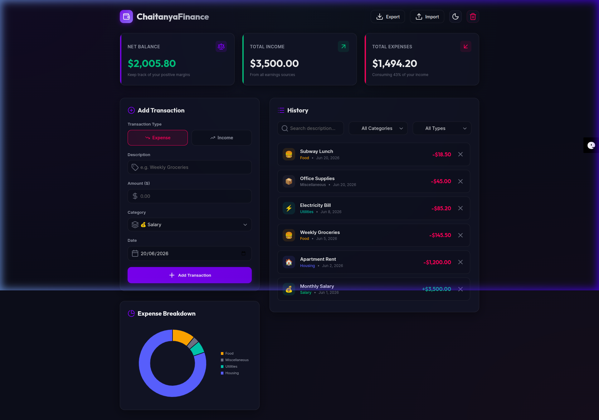
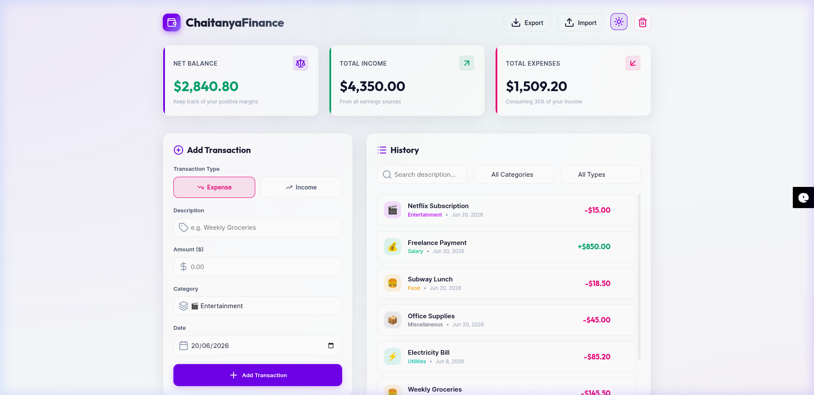
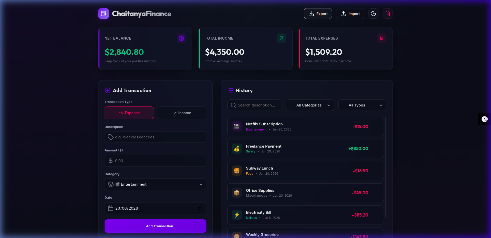

# 💳 ChaitanyaFinance — Personal Wealth Tracker

<p align="center">
  
</p>

<p align="center">
  <strong>A modern, glassmorphism-styled personal finance tracker — built with Node.js, Express, and SQLite. Developed entirely through Vibe Coding using Antigravity AI.</strong>
</p>

<p align="center">
  <a href="https://www.linkedin.com/in/chaitanya-dasadiya">
    
  </a>
  
  
  
  
  
</p>

---

## 🎨 Visual Showcase

### 🌓 Dark Mode vs Light Mode

| 🌌 Dark Mode (Default) | ☀️ Light Mode |
|:---:|:---:|
|  |  |

### 📸 Final Dashboard State



> **Note on Demo Video:** GitHub does not natively support embedded video files in README. To view the full interactive demo recording, please **[click here to watch the demo](./assets/demo-recording.webp)** or clone the repo locally and open `assets/demo-recording.webp` in your browser.

---

## ✨ Features

ChaitanyaFinance covers all the essentials you'd need to track personal finances simply and beautifully.

### 💰 Financial Dashboard
| Feature | Description |
|---|---|
| **Net Balance Card** | Dynamically calculates and displays your total balance (Income − Expenses). Turns green when positive, red when negative |
| **Total Income Card** | Shows the running sum of all income-type transactions across all categories |
| **Total Expenses Card** | Shows cumulative outgoings, with a dynamic subtitle showing the % of income consumed |

### 📝 Transaction Management
| Feature | Description |
|---|---|
| **Add Transaction** | Quick-entry form with Description, Amount, Category (8 presets), Date picker, and Income/Expense type selector |
| **Input Validation** | Client-side validation ensures no empty description, positive amount only, and date is required |
| **Delete Transaction** | One-click delete button on each row with instant DB sync and UI refresh |
| **Clear All Data** | Full database reset with a confirmation modal (warning overlay with cancel option) |
| **Transaction History** | Scrollable, animated list sorted by date (newest first) with category emoji icons and color-coded amounts |

### 🔍 Search & Filtering
| Feature | Description |
|---|---|
| **Live Search** | Instant text-based filtering of transaction descriptions as you type |
| **Category Filter** | Dropdown to filter history by a specific category (Food, Housing, Entertainment, etc.) |
| **Type Filter** | Switch between All, Income Only, or Expense Only views instantly |

### 📊 Visual Analytics
| Feature | Description |
|---|---|
| **Doughnut Chart** | Interactive Chart.js expense breakdown chart with animated segments per category |
| **Category Colours** | Each of the 8 categories (Food 🍔, Salary 💰, Housing 🏠, Utilities ⚡, Entertainment 🎬, Transport 🚗, Shopping 🛍️, Miscellaneous 📦) has a unique color identifier |
| **Empty State Handling** | Chart panel shows a graceful empty state when no expense data is available |

### 💾 Data Persistence & Backup
| Feature | Description |
|---|---|
| **SQLite Database** | All transactions are saved to `database.sqlite` via an Express REST API — data persists across sessions and restarts |
| **Auto-seed on First Boot** | Database is seeded with 5 sample transactions on first startup if empty |
| **Export to JSON** | Download all your transaction data as a `.json` backup file with a single click |
| **Import from JSON** | Restore or load transaction data from a previously exported JSON file — server validates the schema before replacing data |

### 🎨 UI/UX & Design
| Feature | Description |
|---|---|
| **Glassmorphism Design** | Premium dark slate theme with backdrop blur panels, subtle borders, and box shadows |
| **Light / Dark Mode Toggle** | Switch themes with a single click — preference saved to browser localStorage |
| **Micro-animations** | Slide-in entrance animations for new transactions, hover lift effects on cards, scale transitions on buttons |
| **Toast Notifications** | Floating non-blocking alerts for success/error feedback (validation errors, import messages, etc.) |
| **Responsive Layout** | Adapts to desktop, tablet, and mobile screen sizes using CSS Grid and Flexbox |
| **Premium Fonts** | Uses `Outfit` (headings) and `Inter` (body) Google Fonts for a polished look |

### 🔌 Backend REST API
| Endpoint | Method | Description |
|---|---|---|
| `/api/transactions` | `GET` | Fetch all transactions from SQLite |
| `/api/transactions` | `POST` | Add a new transaction (validated server-side) |
| `/api/transactions/:id` | `DELETE` | Delete a single transaction by ID |
| `/api/transactions` | `DELETE` | Clear all transactions from the database |
| `/api/transactions/import` | `POST` | Bulk import transactions (atomic DB transaction) |

---

## 🚀 Quick Start

### Prerequisites
- **Node.js** v20+ ([Download](https://nodejs.org/))
- **npm** v10+

### Installation & Run
```bash
# 1. Clone the repository
git clone https://github.com/cdasadiya/personal-finance-app.git
cd personal-finance-app

# 2. Install dependencies
npm install

# 3. Start the server
npm start

# 4. Open in your browser
# Navigate to http://localhost:8080
```

The app will:
- Auto-create `database.sqlite` on first boot
- Seed 5 sample transactions if the database is empty
- Serve the frontend and API on port `8080`

---

## 📁 Project Structure

```text
personal-finance-app/
├── assets/
│   ├── dashboard-dark.png     # Dark theme screenshot
│   ├── dashboard-light.png    # Light theme screenshot
│   ├── final-state.png        # Final dashboard state screenshot
│   └── demo-recording.webp   # Full demo session recording
├── database.sqlite            # SQLite DB (auto-created on startup, gitignored)
├── server.js                  # Express server: API routes + DB init + static serving
├── app.js                     # Frontend logic: fetch calls, rendering, charts, filters
├── index.html                 # App layout: header, cards, form, history, modals
├── index.css                  # Styles: glassmorphism tokens, animations, responsive layout
├── package.json               # Node.js project manifest
├── requirements.txt           # System & dependency version requirements
└── README.md                  # This documentation file
```

---

## 🛠️ Built with Vibe Coding & Antigravity AI

ChaitanyaFinance was engineered entirely through **Vibe Coding** — a development methodology where you describe features in natural language and an AI coding agent (Antigravity) handles implementation, testing, and deployment.

### 💡 Key Prompts Used

| Step | Prompt |
|---|---|
| **1. Brainstorm** | *"Please build a simple personal finance application. Let's brain storm. Keep it very simple."* |
| **2. PRD** | *"Please prepare the PRD document before building anything"* |
| **3. Build** | *(Approved the PRD — Antigravity wrote all HTML, CSS, JS from scratch)* |
| **4. Documentation** | *"prepare the readme.md file for the development"* |
| **5. Database** | *"can you store the data into database and how about sqlite?"* |
| **6. Backend** | *"go ahead with Option A: Small Node.js (Express) Backend with SQLite"* |
| **7. Deploy** | *"Please use this repo to commit the code into github"* |
| **8. Rename & Polish** | *"rename AuraFinance to ChaitanyaFinance across the entire project"* |

### 🤖 What Antigravity Did Autonomously
- **Planned** the architecture (PRD, implementation plans, task checklists)
- **Wrote** all HTML, CSS, JavaScript, and Node.js code
- **Designed** the glassmorphism UI, color palette, and animation system
- **Built** the Express REST API and SQLite database schema
- **Tested** everything with autonomous browser sub-agents (clicking, typing, verifying calculations)
- **Captured** screenshots and demo recordings during testing
- **Deployed** by initializing git, writing commit messages, and pushing to GitHub

---

## 👤 Author

Made with ❤️ by **Chaitanya Dasadiya**

<p>
  <a href="https://www.linkedin.com/in/chaitanya-dasadiya">
    
  </a>
  &nbsp;
  <a href="https://github.com/cdasadiya">
    
  </a>
</p>

---

## 📜 License

This project is open-source and licensed under the [MIT License](https://opensource.org/licenses/MIT).
